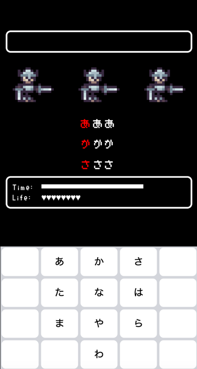

# Flick Quest

Game which is forked from `parcel-pixijs-quickstarter` and apply MVC



### Quick start

```bash
# clone the repo.
git clone https://github.com/markkong318/flick-quest.git

# go to the repo
cd flick-quest

# install the dependencies via npm
npm install

# start the server in dev mode with HMR
npm run start
```
go to [http://localhost:1234](http://localhost:1234) in your browser. Done.

DEMO: [https://markkong318.github.io/flick-quest/](https://markkong318.github.io/flick-quest/)

# Asset
Undead asset pack
https://deepdivegamestudio.itch.io/undead-asset-pack?download
